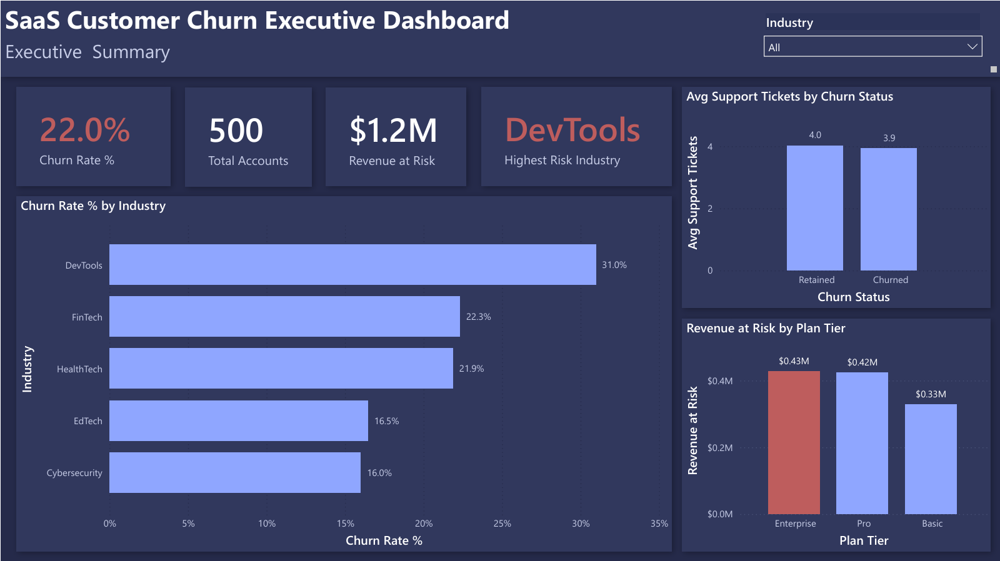
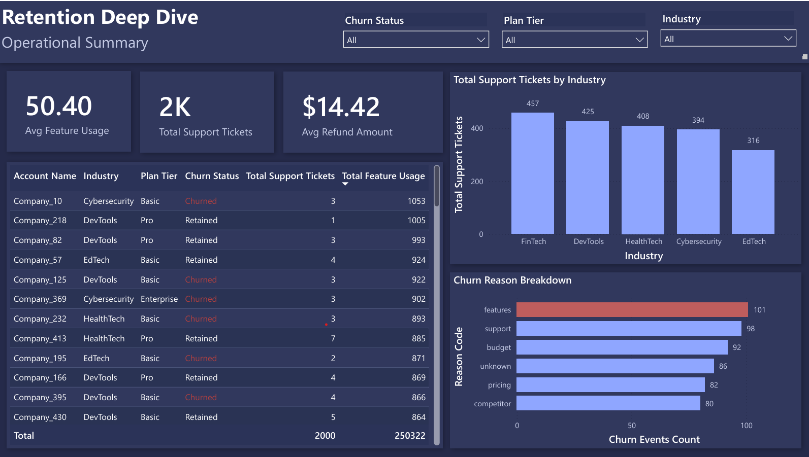

# RavenStack: SaaS Customer Churn Analysis


**End-to-end analytics project** — SQL + Python (pandas) + Power BI — investigating what behavioral and support signals predict customer churn in a SaaS business, and which customer segments to prioritize for retention.

---

## Business Question

What behavioral, subscription, and support signals predict churn — and which industries, plan tiers, and account segments should the business prioritize for retention efforts?

---

## Data Source & Disclosure

This project uses a **synthetic** dataset — *Rivalytics SaaS Customer Churn Dataset*, created by **River (Rivalytics)** and published on Kaggle. The data does not represent a real company; all account names, metrics, and events are generated for analytics practice purposes.

Full credit to River @ Rivalytics for the dataset design.

### Dataset Tables

| Table | Description |
|--------|-------------|
| `accounts` | One row per customer account (industry, plan tier, signup info, churn flag) |
| `subscriptions` | Subscription history per account (multiple rows per account possible due to plan changes) |
| `feature_usage` | Product usage logs |
| `support_tickets` | Customer support interaction history |
| `churn_events` | Historical log of churn-related events |

---

## Tools & Stack

- **SQLite** — Relational querying
- **Python (pandas)** — Cross-validation of SQL results and exploratory analysis
- **Power BI** — Two-page interactive dashboard
- **Jupyter Notebook** — Analysis environment
- **GitHub** — Version control & publishing

---

## Methodology

Every query in this project was independently verified in **two ways**:

1. SQL
2. Python (pandas)

Results were accepted only after both methods produced identical outputs. This validation process helped identify and fix a real data quality issue (see **Technical Challenge**).

---

# Key Findings

## 1. Churn Rate by Industry

DevTools has the highest churn rate (**30.97%**), considerably higher than FinTech (**22.32%**) and HealthTech (**21.88%**). Cybersecurity is the most stable segment (**16.00%**).

| Industry | Total Accounts | Churned | Churn Rate |
|----------|---------------:|---------:|-----------:|
| DevTools | 113 | 35 | 30.97% |
| FinTech | 112 | 25 | 22.32% |
| HealthTech | 96 | 21 | 21.88% |
| EdTech | 79 | 13 | 16.46% |
| Cybersecurity | 100 | 16 | 16.00% |

**Business Insight**

> DevTools should be the highest-priority segment for customer retention efforts.

---

## 2. Support Tickets vs Churn

Average support tickets:

| Customer Status | Avg. Support Tickets |
|-----------------|----------------------:|
| Retained | 4.02 |
| Churned | 3.93 |

Although many expect churned customers to create more support tickets, the difference is minimal.

**Business Insight**

Raw support ticket volume alone is **not** a reliable predictor of churn. Ticket quality or issue type would likely provide more predictive value.

---

## 3. Highest-Revenue Churned Subscription Events

Ranking churned subscription periods by Monthly Recurring Revenue (MRR):

| Plan Tier | Top Account | MRR at Churn |
|-----------|-------------|-------------:|
| Enterprise | A-118f1c | $25,472 |
| Enterprise | A-d4e0d4 | $23,283 |
| Pro | A-104f1a | $6,027 |
| Basic | A-18793f | $2,812 |

> **Note:** This analysis ranks churn **events**, not customer accounts. Because customers may churn, return, and churn again, the same account can legitimately appear multiple times.

---

## 4. Feature Usage Comparison

Average feature usage:

| Customer Status | Average Feature Usage |
|-----------------|----------------------:|
| Retained | 50.52 |
| Churned | 49.24 |

The difference is extremely small.

**Business Insight**

Lifetime-average feature usage is not a strong differentiator between retained and churned customers.

---

## 5. Highest-Revenue Currently Churned Accounts

Unlike Finding #3, this analysis ranks each customer's **latest subscription state**, answering:

> Which currently churned customers were worth the most when they left?

Top churned account:

| Account | Plan | Monthly Revenue |
|---------|------|----------------:|
| Company_23 | Basic | $1,634 |

---

# Dashboard

The Power BI report consists of **two interactive pages**.

## Executive Summary

Includes:

- Churn Rate
- Total Accounts
- Revenue at Risk
- Highest-Risk Industry
- Industry Churn Comparison
- Revenue at Risk by Plan Tier

Color coding:

- 🔴 Red = High Risk


---

## Retention Deep Dive

Includes:

- Industry slicers
- Plan Tier slicers
- Churn Status slicers
- Account-level risk table
- Churn reason breakdown
- Support ticket analysis
- Feature usage comparison

### Dashboard Screenshots



---

# Technical Challenge

While building the **Top Churned Accounts by Revenue** query, the initial SQL produced inflated rankings.

### Root Cause

The `subscriptions` table stores **subscription history**, meaning one customer can have multiple subscription records.

The ranking query mistakenly included historical subscriptions instead of only the latest subscription.

### Solution

Used:

```sql
ROW_NUMBER() OVER (
    PARTITION BY account_id
    ORDER BY start_date DESC
)
```

inside a Common Table Expression (CTE) to isolate the newest subscription before ranking.

This follows the important analytics principle:

> **Collapse before Aggregate**

The issue was detected because SQL and pandas produced different outputs during cross-validation.

---

### Event-Level vs Account-Level Analysis

Another interesting observation occurred during the event-level ranking query.

One account appeared twice.

Investigation confirmed this was **not** an error.

The customer had:

- Churned
- Returned
- Churned again

Since the analysis was performed at the **event level**, duplicate accounts were expected and therefore correct.

---

# Known Limitations

1. Feature usage is calculated as a **lifetime average**, which can hide recent declines in product engagement.

2. Subscription history required deduplication to avoid counting outdated subscriptions.

3. The dataset is synthetic and intended for portfolio demonstration rather than representing real-world SaaS behavior.

---

# How to Run

Clone the repository:

```bash
git clone https://github.com/rafiahussain-codes/ravenstack.git
```

Move into the project:

```bash
cd ravenstack
```

Install dependencies:

```bash
pip install -r requirements.txt
```

Launch the notebook:

```bash
jupyter notebook analysis.ipynb
```

To view the dashboard, open:

```text
dashboard/ravenstack_dashboard.pbix
```

using **Power BI Desktop**.

---


# Author

**Rafia Hussain**

**Data Analyst | Power BI | Python | BS Computer Science Student**

GitHub: **https://github.com/rafiahussain-codes**

---

## Dataset Credit

River (@Rivalytics)

Kaggle — Rivalytics SaaS Customer Churn Dataset
